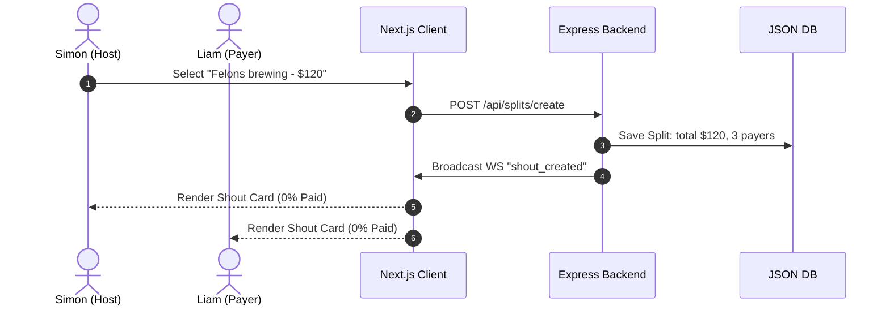

# Create Investor Demo Scenario

This document outlines the end-to-end user experience and backend system verification flow for our upcoming June investor demo. The demo showcases a live group bill-splitting scenario at **Felons Brewing Co. (Brisbane)** to secure a **$500,000 AUD pre-seed round** from angel investors.

---

## 1. Demo Objectives & Success Metrics
The target of this live demo is to walk investors through a complete social fintech checkout flow under real-world conditions (including simulated network dropouts common in crowded pubs/basement bars).

*   **Core Message**: "Paying together is as easy as chatting together."
*   **Key Capabilities Shown**:
    1.  Instant room creation & real-time member join via WebSockets.
    2.  Plaid Link integration to import bank transactions in seconds.
    3.  Stripe Sandbox card payments with real-time UI progress updates.
    4.  Network resilience (automatic Socket.io reconnection & state reconciliation).
    5.  Revenue model clarity (automatic calculation of 1.5% Stripe convenience fee, $3.99/mo Pro tier, and 1% express payouts).

---

## 2. Setup & Prerequisites

### 2.1 Environmental Config
To prepare the environment, ensure the `.env` file in the project root matches these configurations:
*   `PORT=3001` (Backend server)
*   `NEXT_PUBLIC_SOCKET_URL=http://localhost:3001`
*   `PLAID_ENV=sandbox` (Fallback to mock transaction data if Plaid credentials are empty)
*   `STRIPE_SECRET_KEY` (Stripe Sandbox developer key, or fallback to 1s mock payment delay if blank)

### 2.2 Device Viewport Setup
*   Since Shout is a **mobile-first PWA**, the Next.js client renders with a centered mobile phone mock frame on desktop viewports.
*   For the demo, open three browser windows side-by-side or use three separate mobile devices scanned via QR code.

---

## 3. Demo Persona Cast
*   **Host (Simon)**: Group creator, connects his bank account via Plaid, creates the split.
*   **Payer 1 (Liam)**: Group member, pays his share via Stripe.
*   **Payer 2 (Chloe)**: Group member, pays her share via Stripe, simulates a network drop during the flow.

---

## 4. Step-by-Step Scenario Walkthrough

### Step 1: Room Creation (Simon)
1.  **Action**: Simon opens the Shout webapp, taps **"Start a Shout"**, and names the room **"Felons Sunday Session"**.
2.  **System Activity**: 
    *   Client triggers `POST /api/groups` to create the group ledger.
    *   Socket.io client establishes a persistent connection and emits `join_room` with `{ roomId, userId }`.
3.  **UI Feedback**: A clean chat screen loads. A **"Share to Invite"** drawer pops up showing a QR code and a copyable room URL: `http://localhost:3000/room/[roomId]`.

### Step 2: Friends Join (Real-time Socket.io)
1.  **Action**: Liam and Chloe scan the QR code on Simon's screen, enter their names, and tap **"Join Shout"**.
2.  **System Activity**:
    *   Liam and Chloe's clients establish socket connections and emit `join_room`.
    *   Socket.io server broadcasts member lists to all clients in `roomId`.
3.  **UI Feedback**: 
    *   Simon's chat screen updates in real-time showing slide-in banners: *"Liam joined the room"* and *"Chloe joined the room"*.
    *   The active member count in the top-right header updates to **3**.

### Step 3: Bank Transaction Sync (Plaid Sandbox)
1.  **Action**: Simon taps **"Sync Bill"** in the chat inputs.
2.  **Verification Flow**:
    *   **Plaid Link Popup**: Simon authenticates via the Plaid Sandbox selector interface (using the mock username `user_good` and password `mypassword`).
    *   **Transaction Fetch**: Simon selects the transaction: **"Felons Brewing Co. — $120.00 AUD"**.
3.  **System Activity**:
    *   Client exchanges Plaid public token via `POST /api/plaid/exchange-token`.
    *   Backend fetches transactions via `GET /api/transactions`.
    *   Backend computes the 3-way split: **$40.00 AUD each**.
    *   Backend saves the new record to `packages/backend/src/data/db.json` and emits `shout_created` containing the `Split` object.
4.  **UI Feedback**:
    *   An interactive **"Shout Card"** is instantly injected into all three users' chat feeds.
    *   **Card Details**: 
        *   Merchant: *Felons Brewing Co.*
        *   Total: *$120.00 AUD*
        *   Split Ratio: *3 ways ($40.00 AUD each)*
        *   Progress bar status: **0% Paid ($0.00 / $120.00)**.
        *   A prominent primary button: **"Pay $40.00 AUD Share"**.

### Step 4: First Payment & Real-Time Sync (Liam)
1.  **Action**: Liam clicks **"Pay $40.00 AUD Share"** on his Shout Card.
2.  **Payment Processing**: 
    *   Liam's UI displays a Stripe Elements credit card iframe. 
    *   Liam inputs Stripe Sandbox credentials (`4242 4242 4242 4242`, Expiry: `12/28`, CVC: `123`).
    *   Liam clicks **"Confirm Payment"**.
3.  **System Activity**:
    *   Backend receives `POST /api/payments/charge` with body `{ splitId, userId }`.
    *   Backend utilizes **Stripe Idempotency Keys** (`shout_charge_[splitId]_[userId]`) to guarantee zero double-charging.
    *   Stripe charges the card, backend marks Liam's payer status as `paid: true` in the DB.
    *   Backend broadcasts WS event `payment_completed` with payload `{ userId, splitId, progressPercent: 33 }`.
4.  **UI Feedback**:
    *   Liam's screen shows a green checkmark animation: *"Paid $40.00 AUD to Simon"*.
    *   All participants see the Shout Card progress bar slide smoothly to **33% ($40.00 / $120.00)**.
    *   Liam's status updates from **"Unpaid"** to a green badge **"Paid"**.

### Step 5: Network Drop & State Reconciliation (Chloe)
1.  **Action**: Chloe clicks **"Pay $40.00 AUD Share"** but enters a spotty connection zone (e.g. basement bar simulation by toggling DevTools Offline mode or unplugging the network).
2.  **Resilience Validation**:
    *   Chloe's client shows a yellow status strip: *"Reconnecting..."*
    *   The "Pay" button on Chloe's card is temporarily disabled to prevent duplicate network payloads.
    *   Chloe's connection is restored (Online mode enabled).
    *   Socket.io client executes auto-reconnection parameters:
        *   `reconnectionAttempts: Infinity`
        *   `reconnectionDelayMax: 5000`
3.  **System Activity**:
    *   On Socket.io reconnect, the client issues `GET /api/splits/:id/sync` to fetch the ledger state.
    *   Backend checks DB and returns the fresh state.
    *   Chloe's UI reconciles by overwriting its local React state.
4.  **UI Feedback**: 
    *   The *"Reconnecting..."* banner disappears.
    *   Chloe's Shout Card updates to show Liam's payment is already verified (progress bar remains correct at 33%).
    *   Chloe proceeds to pay her $40.00 AUD share, updating the progress bar to **66% ($80.00 / $120.00)**.

### Step 6: Completion & Monetization Payout (Simon)
1.  **Action**: Simon pays his own $40.00 AUD share to complete the split.
2.  **System Activity**:
    *   Stripe processes the final transaction.
    *   Backend detects all 3 payers are `paid: true`.
    *   Backend broadcasts `payment_completed` with `progressPercent: 100`.
3.  **UI Feedback**:
    *   Confetti animation bursts on all screens.
    *   The Shout Card changes status to **"Completed & Paid"**.
    *   Simon's host dashboard unlocks the **"Settlement Drawer"**:
        *   **Total Collected**: $120.00 AUD.
        *   **Stripe Convenience Fee (1.5%)**: $1.80 AUD (calculated automatically).
        *   **Net Payout**: $118.20 AUD.
        *   **Payout Options**:
            *   *Standard Payout*: 2-3 business days (Free).
            *   *Express Payout (1% fee / instant)*: $1.18 AUD charge to payout immediately (Highlighting our monetization loop).

---

## 5. Technical Validation Log Checklist (Aiden's Corner)

For verification purposes during coding and demo setup, verify the following console log outputs:

| Phase | Expected Node Express Logs | Expected Next.js Console Logs |
| :--- | :--- | :--- |
| **Room Creation** | `[Socket.io] User [ID] joined room: [Room-ID]` | `[Socket] Connected with Socket ID: [ID]` |
| **Plaid Import** | `[Plaid] Fetched transactions successfully. Felons Brewing Co. found.` | `[Plaid] Link flow complete. Exchanging public token...` |
| **Stripe Charge** | `[Stripe] Charge successful with Idempotency Key: shout_charge_[Split-ID]_[User-ID]` | `[Payment] PaymentIntent confirmed. Splitting state updated.` |
| **Reconnection** | `[Socket.io] Client [ID] re-established connection.` | `[Socket] Disconnected. Re-triggering sync ledger endpoint...` |

---

## 6. Key References
*   [Product Requirements Document (PRD)](file:///Users/kong/Desktop/Develop/VirtualWork/virtual-work/shout_wiki/SHOUT-PRD.md)
*   [Technical Specification](file:///Users/kong/Desktop/Develop/VirtualWork/virtual-work/shout_wiki/SHOUT-TECH-SPEC.md)
*   [WebSocket State Reconciliation & Resilience Guidelines](file:///Users/kong/Desktop/Develop/VirtualWork/virtual-work/shout_wiki/WEBSOCKET-RESILIENCE-GUIDELINES.md)
*   [Milestones & Roadmap](file:///Users/kong/Desktop/Develop/VirtualWork/virtual-work/shout_wiki/MILESTONES.md)
