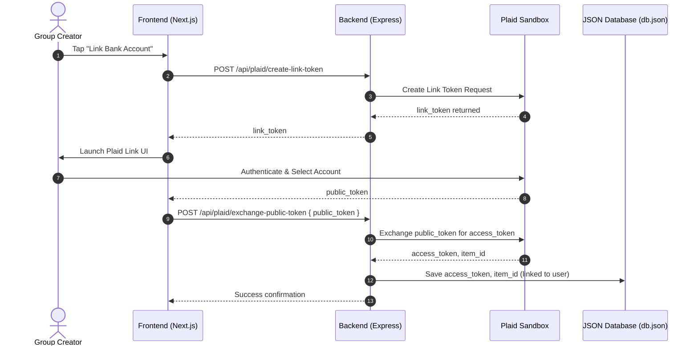

# Plaid Integration and Webhook Sync Spec

This specification defines the authentication flow, API integration endpoints, and webhook synchronization logic for linking external bank accounts to Shout via the Plaid Sandbox. It ensures that transaction splits are synchronized in real-time while preventing duplicate splits, reconciliation issues, and double charging.

---

## 1. Integration Scope & Architecture

Shout uses Plaid to let group creators sync their bank transaction history and select a bill to split. To achieve this, the system connects to the Plaid Sandbox environment and tracks transaction updates via webhooks.



---

## 2. Shared Type Definitions

All Plaid integration endpoints and payloads must be strictly typed. Using the `any` type is strictly forbidden. 

```typescript
// packages/shared/src/types/plaid.ts

export interface PlaidLinkTokenResponse {
  linkToken: string;
  expiration: string;
}

export interface PlaidTokenExchangeRequest {
  publicToken: string;
}

export interface PlaidTokenExchangeResponse {
  success: boolean;
  itemId: string;
}

export interface PlaidTransaction {
  id: string; // Map to Plaid's transaction_id
  accountId: string;
  amount: number; // Positive values are debits (spending) in Plaid v2
  date: string;
  name: string;
  merchantName: string | null;
  pending: boolean;
  pendingTransactionId: string | null; // Plaid maps settled txns to their pending counterparts here
}

export interface PlaidSyncState {
  itemId: string;
  accessToken: string;
  cursor: string | null;
  userId: string;
}

export interface PlaidWebhookPayload {
  webhook_type: "TRANSACTIONS";
  webhook_code: "SYNC_UPDATES_AVAILABLE" | "INITIAL_UPDATE" | "HISTORICAL_UPDATE" | "DEFAULT_UPDATE";
  item_id: string;
  new_transactions?: number;
}
```

---

## 3. API Endpoint Specifications

### 3.1 Create Link Token
*   **Path**: `POST /api/plaid/create-link-token`
*   **Authentication**: Required (JWT Bearer Token)
*   **Behavior**: Generates a configuration token required by the Plaid Link client SDK.
*   **Mock Fallback**: If `PLAID_CLIENT_ID` or `PLAID_SECRET` are not set in the environment, the endpoint returns a dummy string `"mock_link_token_123"` to bypass external network calls in local dev.

### 3.2 Exchange Public Token
*   **Path**: `POST /api/plaid/exchange-public-token`
*   **Authentication**: Required
*   **Body**:
    ```json
    { "publicToken": "public-sandbox-xxxxxx" }
    ```
*   **Behavior**: Exchange the short-lived `public_token` from the client for a persistent `access_token` and `item_id`. The backend must write these securely to `db.json`.
*   **Error Handling**: If the database write fails (e.g. timeout or disk lock), the backend must log the error details and abort the exchange, returning a `500` response.

### 3.3 Fetch Sync Transactions
*   **Path**: `GET /api/plaid/transactions`
*   **Authentication**: Required
*   **QueryParams**: `limit` (default: 20), `cursor` (string)
*   **Behavior**: Fetches transactions from Plaid using the cached `access_token` for the authenticated user.
*   **Mock Mode**:
    If running without API credentials, the endpoint reads from a static JSON array of local Brisbane merchant transactions to populate the UI:
    ```json
    [
      {
        "id": "mock_txn_001",
        "accountId": "mock_acc_99",
        "amount": 84.50,
        "date": "2026-06-01",
        "name": "Felons Brewing Co. Table 14",
        "merchantName": "Felons Brewing Co.",
        "pending": false,
        "pendingTransactionId": null
      },
      {
        "id": "mock_txn_002",
        "accountId": "mock_acc_99",
        "amount": 12.00,
        "date": "2026-06-01",
        "name": "The Bunker West End",
        "merchantName": "The Bunker",
        "pending": true,
        "pendingTransactionId": null
      }
    ]
    ```

---

## 4. Webhook Sync Engine & Reconciliation Flow

Plaid fires a webhook when new transactions are imported or state changes (e.g. pending transactions settle). 

*   **Endpoint**: `POST /api/plaid/webhook`
*   **Webhook Code**: `SYNC_UPDATES_AVAILABLE`

### 4.1 Increment Sync via Plaid `/transactions/sync`
When receiving a webhook, the backend worker must fetch incremental updates using Plaid's `/transactions/sync` endpoint, supplying the last saved sync `cursor`.

```typescript
// Pseudocode for Webhook Handler Block
async function handleTransactionsSync(itemId: string) {
  const syncState = await getPlaidSyncStateFromDB(itemId);
  let cursor = syncState.cursor;
  let hasMore = true;

  while (hasMore) {
    const response = await plaidClient.transactionsSync({
      access_token: syncState.accessToken,
      cursor: cursor || undefined,
      count: 100,
    });

    const { added, modified, removed, next_cursor, has_more } = response.data;

    // Process records inside a database transaction to ensure atomicity
    await executeDatabaseTransaction(async (dbClient) => {
      // 1. Remove transactions
      for (const txn of removed) {
        await dbClient.removeTransaction(txn.transaction_id);
      }

      // 2. Add and update transactions (deduplicating pending vs settled)
      for (const txn of [...added, ...modified]) {
        await reconcileTransactionRecord(dbClient, txn);
      }

      // 3. Persist the cursor state
      await dbClient.updateSyncCursor(itemId, next_cursor);
    });

    cursor = next_cursor;
    hasMore = has_more;
  }
}
```

### 4.2 Preventing Duplicate Splits (Pending vs. Settled Reconciliation)

When a card transaction occurs, it first appears as **pending** (e.g., amount is estimated, transaction status is unsettled). Once the merchant processes it, Plaid publishes a **settled** version of the transaction.
- The pending transaction has `pending = true` and `transaction_id = "pending_abc"`.
- The settled transaction has `pending = false` and a new `transaction_id = "settled_xyz"`.
- Crucially, the settled transaction contains a field: `pending_transaction_id = "pending_abc"`.

If the system inserts both records, users will see the same charge twice in their feed, leading to duplicate bill splits and accidental double charging.

**Reconciliation Rules**:
1. When checking a incoming transaction `T`:
   - If `T.pendingTransactionId` is not null:
     - Search the database for an existing record where `id === T.pendingTransactionId`.
     - If found, **update** the record:
       - Set its status `pending` to `false`.
       - Update the `id` to the new settled `T.transaction_id`.
       - Update the final settled `amount` (as tipping or tabs can adjust final charge amounts).
       - Maintain any existing links to active Shout split bills.
     - If not found (e.g. pending transaction was never imported), insert the transaction as a settled record.
   - If `T.pendingTransactionId` is null:
     - Insert or update the transaction directly by matching `T.transaction_id`.

---

## 5. Database Connection Resiliency & Webhook Retry Policies

Webhooks are stateless notifications delivered asynchronously over the web. Because the system can experience momentary network issues, database connection interruptions are inevitable.

### 5.1 Webhook Transaction Boundaries
If the backend receives a webhook event, parses the payload, and starts the sync query, but the database connection drops halfway through:
- The backend must **abort** the synchronization process.
- It must **not** save the `next_cursor` value to the database. If the cursor is updated in memory but not persisted along with the transaction changes, the backend will miss processing these transactions during the next sync run.
- It must **not** return a success code to Plaid.

### 5.2 Retry Logic & Error Boundaries
Plaid expects a response to webhooks within a few seconds.
- If database operations fail, return a `503 Service Unavailable` or `500 Internal Server Error`.
- Do not catch database errors and return a `200 OK`. Returning `200` signals to Plaid that the data was successfully ingested, and Plaid will not resend that specific webhook notification.
- Plaid will retry webhook notifications that return a non-200 code at increasing intervals over a period of 40 hours.

```typescript
// POST /api/plaid/webhook
app.post("/api/plaid/webhook", async (req, res) => {
  const payload: PlaidWebhookPayload = req.body;
  const webhookId = req.headers["plaid-verification-hook-id"] as string;

  try {
    if (payload.webhook_type === "TRANSACTIONS" && payload.webhook_code === "SYNC_UPDATES_AVAILABLE") {
      // Process sync
      await handleTransactionsSync(payload.item_id);
    }
    
    // Acknowledge receipt only after successful DB writes
    return res.status(200).json({ status: "processed" });
  } catch (error) {
    console.error(`Failed to process Plaid Webhook [${webhookId}]:`, error);
    
    // What happens when the DB connection drops?
    // We explicitly return a 503 to trigger a Plaid retry later when DB is back up
    return res.status(503).json({ 
      error: "Service temporarily unavailable. DB synchronization failure.",
      retry: true 
    });
  }
});
```

---

## 6. Verification Guidelines

To verify the integration in the Sandbox environment:
1. **Initial Sync verification**: Trigger `INITIAL_UPDATE` webhooks using Plaid Sandbox dashboard controls to populate the database.
2. **Reconciliation Test**: Simulate transitioning a pending transaction to settled by triggering a `DEFAULT_UPDATE` sandbox event, and verify that the database record is updated without duplication.
3. **DB Interruption Simulation**: Temporarily disable backend access to the database (e.g. rename or lock `db.json`) during a simulated webhook event. Verify the backend responds with a `503` status and does not corrupt or advance the sync cursor.