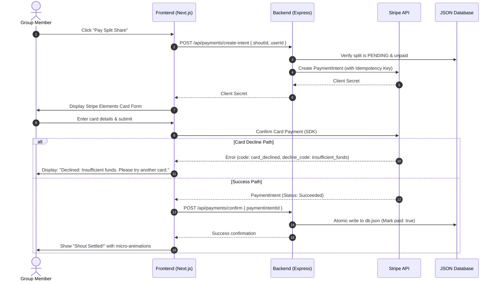
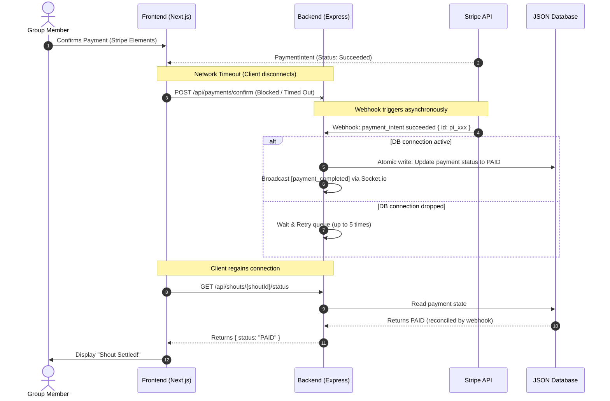

# Shout - Technical Specification

This document defines the core architecture, data schemas, API integrations, and payment resilience patterns for the Shout application. It serves as the primary developer guide for implementing the Sprint 1-3 MVP.

---

## 1. Tech Stack Overview

The Shout MVP is built on a decoupled, mobile-first monorepo architecture:

*   **Frontend**: Next.js (React) styled with Vanilla CSS (and Tailwind v4 configured for mobile responsiveness).
*   **Backend**: Node.js Express server running TypeScript.
*   **Real-time Communication**: Socket.io (WebSocket) for active room state sync.
*   **Database**: A simple, single-file JSON database (`db.json`) for local sandbox environments.
*   **External APIs**: Plaid Sandbox (bank account sync) and Stripe Sandbox (card payment checkout).

---

## 2. Core Database Schema (`db.json`)

All currency amounts, fees, and splits **must** be stored as integers in **cents** to prevent floating-point rounding errors. Storing decimals (e.g. `20.50`) is strictly prohibited.

```json
{
  "users": [
    {
      "id": "usr_01H9Y4X",
      "name": "Liam Connor",
      "email": "liam@shout.financial",
      "stripeCustomerId": "cus_Njk1O2o3",
      "createdAt": 1780237689
    }
  ],
  "groups": [
    {
      "id": "grp_882A1B",
      "name": "Felons Friday Night",
      "members": ["usr_01H9Y4X", "usr_01H9Y4Y"]
    }
  ],
  "shouts": [
    {
      "id": "sht_9281X",
      "groupId": "grp_882A1B",
      "transactionId": "txn_plaid_9921",
      "totalAmount": 12500,
      "convenienceFee": 188,
      "status": "PARTIALLY_PAID",
      "payers": [
        {
          "userId": "usr_01H9Y4X",
          "share": 6250,
          "paid": true,
          "paymentIntentId": "pi_3M7e2C2eZvKYlo2C",
          "paidAt": 1780238900
        },
        {
          "userId": "usr_01H9Y4Y",
          "share": 6250,
          "paid": false,
          "paymentIntentId": null,
          "paidAt": null
        }
      ]
    }
  ],
  "stripe_events": [
    {
      "eventId": "evt_1O2j3k4l5m",
      "processedAt": 1780238905
    }
  ]
}
```

---

## 3. Stripe Integration Design & Fee Calculations

When a user initiates checkout, the backend calculates the total charge including Stripe domestic fees and Shout's net take rate.

### 3.1 Fee Calculation Formula
To ensure Shout does not operate at a loss, we apply a 1.5% markup *on top of* Stripe's standard Australian domestic processing fee (1.75% + $0.30 AUD):

$$\text{Total Charge} = \text{Split Share} + \text{Stripe Base Fee} + \text{Shout Markup}$$

For example, on a **$50.00** split share (`5000` cents):
*   **Stripe Base Fee**: $50.00 \times 1.75\% + \$0.30 = \$1.18$ (`118` cents)
*   **Shout 1.5% Markup**: $50.00 \times 1.5\% = \$0.75$ (`75` cents)
*   **Total Charge**: $50.00 + 1.18 + 0.75 = \$51.93$ (`5193` cents)

---

## 4. Resilient Payment Error-Handling Patterns

To ensure consistent application states during network drops (e.g. when checking out in basement bars or crowded pub venues), the Stripe integration must utilize the following resilience patterns.

### 4.1 Payment Flows (State Transitions)



### 4.2 Checkout Idempotency
To prevent double-charging users during client retries, all payment intent creation requests must supply an `idempotency_key` to the Stripe API.
*   **Idempotency Key Format**: `shout_split_payer_{shoutId}_{userId}`
*   **Backend Behavior**: If a user submits payment, loses connection, and attempts to pay again, Stripe will return the existing `PaymentIntent` rather than spawning a new charge.

### 4.3 Stripe Error Mapping Table
Stripe API errors must be intercepted on the backend, logged with correlation IDs, and mapped to clear, user-facing error objects before reaching the client:

| Stripe Error Code | Decline / API Code | Internal App State | User-Facing Display Message |
| :--- | :--- | :--- | :--- |
| `card_declined` | `insufficient_funds` | `DECLINED_FUNDS` | "Card declined: Insufficient funds. Grab another card or top up." |
| `card_declined` | `lost_card` / `stolen_card` | `DECLINED_RESTRICTED` | "Card declined: This card has been marked as lost or stolen." |
| `expired_card` | N/A | `EXPIRED_CARD` | "Looks like this card has expired. Check the details and try again." |
| `incorrect_cvc` | N/A | `INVALID_CVC` | "The CVC entered is incorrect. Double check the 3-digit security code." |
| `processing_error` | N/A | `GATEWAY_ERROR` | "Payment gateway timed out. Please wait a moment and try again." |
| `rate_limit` | N/A | `RATE_LIMIT_ERROR` | "Too many payment attempts. Take a breather and try in a minute." |

### 4.4 Webhook Reconciliation & State Recovery
When a payment succeeds, the network connection between the mobile client and our Express backend might drop before the client can execute the `POST /api/payments/confirm` endpoint. To reconcile states, the backend must use webhook listeners.



*   **Webhook Action**: Listen for `payment_intent.succeeded` and `payment_intent.payment_failed`.
*   **Idempotency Logging**: The backend checks the `stripe_events` log array inside `db.json` before processing. If the event ID has already been recorded, the webhook returns `200 OK` instantly to prevent double-processing.
*   **WebSocket Broadcast**: Once the state is reconciled, the server broadcasts a `payment_completed` event containing the payload to the room. The client reconciles its local state upon receiving this event.

---

## 5. Shared Type Definitions

```typescript
// packages/shared/src/types/payment.ts

export type PaymentStatus = "PENDING" | "PAID" | "FAILED";

export interface CreatePaymentIntentRequest {
  shoutId: string;
  userId: string;
}

export interface CreatePaymentIntentResponse {
  clientSecret: string;
  totalAmount: number;
  convenienceFee: number;
}

export interface ConfirmPaymentRequest {
  paymentIntentId: string;
  shoutId: string;
  userId: string;
}

export interface ConfirmPaymentResponse {
  success: boolean;
  status: PaymentStatus;
}

export interface PaymentErrorResponse {
  success: false;
  errorCode: string;
  message: string;
  declineCode?: string;
}
```