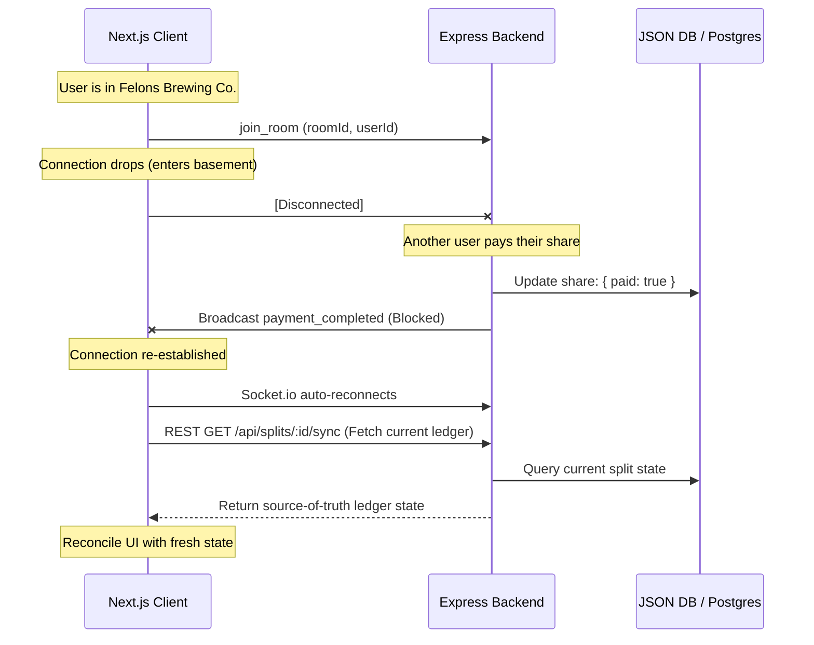

# WebSocket State Reconciliation and Resilience Guidelines

In social fintech applications like **Shout**, real-time correctness is critical—especially when money is changing hands. Since our users frequently split bills in pubs, breweries (e.g., Felons Brewing Co.), and basement venues with spotty cellular reception, we must architect our client-server communication to survive unexpected disconnects, packet loss, and transitions between Wi-Fi and mobile data.

These guidelines define standard design patterns for **Socket.io automatic reconnection**, **offline UI states**, **ledger reconciliation**, and **idempotent payment flows**.

---

## 1. The Resilience Architecture

To ensure consistency, we follow a **Hybrid WebSockets + REST Pull** architecture:
*   **WebSockets (Socket.io)**: Used for optimistic, low-latency, real-time broadcasts (e.g., chat messages, live progress bar updates as people pay).
*   **REST API**: Used as the definitive source of truth. Whenever the connection drops and recovers, the client must pull the latest ledger state from the server.



---

## 2. Client-Side Socket.io Configuration

We use specific parameters on the Socket.io client to handle reconnection attempts aggressively but with exponential backoff to avoid overloading the server.

### Next.js Client Initialization

```typescript
import { io, Socket } from "socket.io-client";

const SOCKET_SERVER_URL = process.env.NEXT_PUBLIC_SOCKET_URL || "http://localhost:3001";

export const initResilientSocket = (token: string): Socket => {
  return io(SOCKET_SERVER_URL, {
    auth: { token },
    reconnection: true,             // Enable automatic reconnection
    reconnectionAttempts: Infinity, // Keep trying to reconnect
    reconnectionDelay: 1000,        // Start trying after 1 second
    reconnectionDelayMax: 5000,     // Never wait more than 5 seconds between attempts
    randomizationFactor: 0.5,       // Randomize delay to prevent Thundering Herd problem
    timeout: 20000,                 // 20s connection timeout before failing a handshake
    transports: ["websocket"],      // Force WebSockets (no HTTP long-polling fallback)
  });
};
```

---

## 3. UI State Lifecycle and Feedback

The user must always know if they are offline to prevent frustration or double actions. 

### Connection Status States
1.  **`connected`**: Normal UI functionality.
2.  **`disconnected` (temporary)**:
    *   Disable high-risk buttons (e.g., "Pay Now", "Create Split").
    *   Show a non-intrusive status banner: *"Reconnecting to Shout server..."*
    *   Queue outgoing chat messages locally (see offline queueing below).
3.  **`reconnected`**:
    *   Trigger reconciliation of the group state and payment ledger.
    *   Flush offline queues.
    *   Restore UI buttons.

### React State Hook Hook Template

```typescript
import { useEffect, useState } from "react";
import { socket } from "@/lib/socket";

export function useSocketStatus(groupId: string, triggerReconciliation: () => void) {
  const [isConnected, setIsConnected] = useState(socket.connected);

  useEffect(() => {
    function onConnect() {
      setIsConnected(true);
      // Trigger reconciliation immediately upon reconnection
      triggerReconciliation();
    }

    function onDisconnect() {
      setIsConnected(false);
    }

    socket.on("connect", onConnect);
    socket.on("disconnect", onDisconnect);

    return () => {
      socket.off("connect", onConnect);
      socket.off("disconnect", onDisconnect);
    };
  }, [groupId, triggerReconciliation]);

  return isConnected;
}
```

---

## 4. Ledger State Reconciliation

When a user reconnects, we cannot guarantee that they received all intermediate websocket messages. To fix this, we implement a **reconciliation protocol**:

### Protocol Rules
1.  **Do not replay events**: Do not attempt to catch up by requesting missed websocket events. This increases code complexity and introduces race conditions.
2.  **State Synchronization Endpoint**:
    *   On reconnect, the client requests the latest state of the active splits/group ledger via `GET /api/splits?groupId=:id`.
    *   The client overwrites its local React state with this fresh server payload.
3.  **Visual Transition**: Show a quick loading state or skeleton screen over the progress bar/split card during reconciliation to avoid flickering UI.

---

## 5. Offline Queueing for Safe Message Delivery

If a user sends a chat message while disconnected, we store it in memory or `localStorage` to avoid losing user input.

```typescript
interface PendingMessage {
  tempId: string;
  roomId: string;
  text: string;
  senderId: string;
}

class OfflineMessageQueue {
  private queue: PendingMessage[] = [];

  enqueue(msg: PendingMessage) {
    this.queue.push(msg);
    // Optionally persist to localStorage
  }

  flush(socket: Socket) {
    while (this.queue.length > 0) {
      const msg = this.queue.shift();
      if (msg) {
        socket.emit("send_message", msg, (ack: { success: boolean }) => {
          if (!ack.success) {
            // Re-enqueue at the front if the message delivery fails
            this.queue.unshift(msg);
          }
        });
      }
    }
  }
}
```

---

## 6. Payment Safety and Idempotency

Preventing double-charging when connections drop mid-payment is our highest priority. We enforce two mechanisms:

### 1) Stripe Idempotency Keys
For the backend API route `POST /api/payments/charge`, the backend **MUST** supply a `Stripe-Idempotency-Key` header to the Stripe client.
*   **Key Construction**: Combine the `splitId` and the payer's `userId`:  
    `idempotencyKey = `shout_charge_${splitId}_${userId}``
*   **Result**: If the client retries the POST request because they didn't get a response (due to network timeout), Stripe detects the duplicate key and returns the original payment status instead of executing a new card charge.

### 2) Database Lock / Status Verification
Before executing any external charge or database update:
1.  Check the JSON / PostgreSQL DB to verify if the user's share is already marked `paid: true`.
2.  If `paid: true`, immediately return success and do not proceed with payment processing.

---

## 7. Developer Implementation Checklist (Aiden's Rules)

- [ ] **No `any`**: Ensure Socket.io events are typed. Define type interfaces for payloads in a shared package (e.g., `packages/shared/types/socket.ts`).
- [ ] **Socket Callbacks**: Always use acknowledgment callbacks for crucial client actions (e.g., `socket.emit("send_message", payload, callback)`).
- [ ] **Error Catching**: Wrap DB writes and Socket.io broadcasts in `try-catch` blocks.
- [ ] **Log Events**: Log connection, disconnect, and reconnect events on both the client and server for easier debugging in the field.
