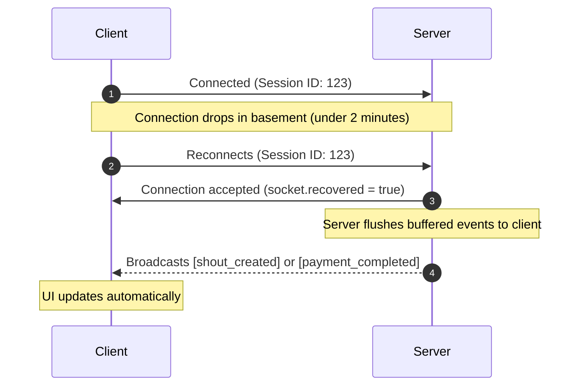
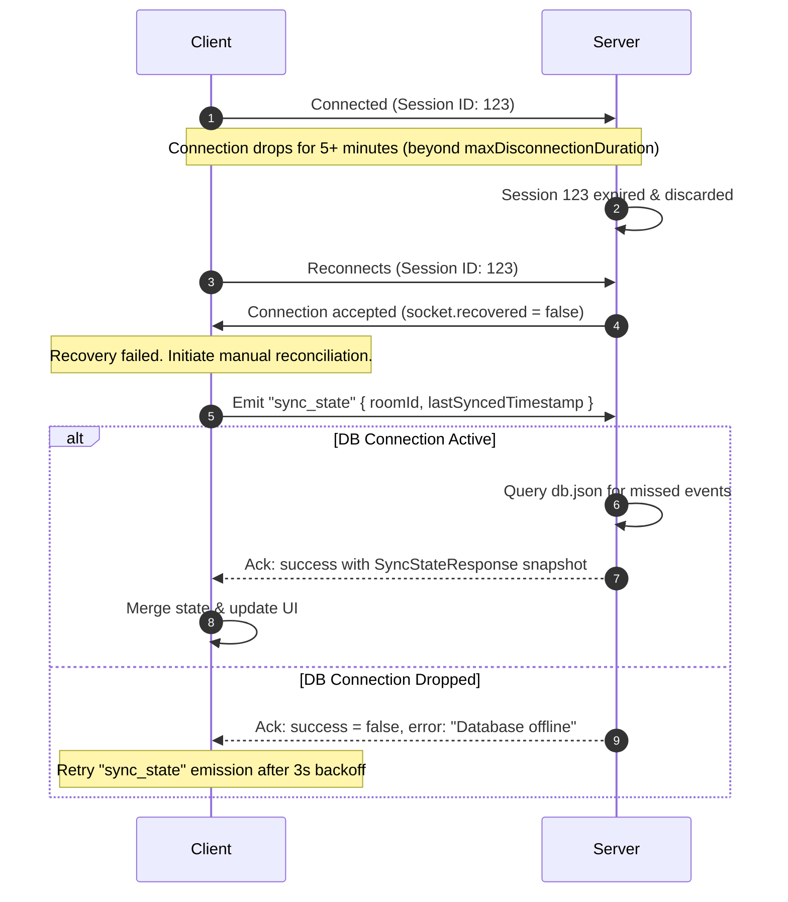

# WebSocket State Reconciliation and Resilience Guidelines

This document outlines the connection resilience, recovery, and state reconciliation strategies for the Shout real-time communication stack. It details how the Next.js frontend and Node.js Express backend (using Socket.io) maintain state consistency when users experience network dropouts, which is common in basement bars and pub venues (e.g., Felons Brewing Co. or West End watering holes).

---

## 1. Core Architecture Goals

To prevent payment status desynchronization, lost chat messages, or double-charging errors during a network hiccup, the Shout socket layer must be designed with three core architectural pillars:

```
+--------------------------------------------------------------------------+
|                               PILLARS                                    |
+--------------------------------------------------------------------------+
| 1. Auto Session Recovery  | 2. Idempotent Acks    | 3. Snapshot Sync     |
| (Socket.io v4 Buffer)     | (Explicit Client Retries)| (Full DB State Fetch) |
+--------------------------------------------------------------------------+
```

1. **Automatic Session Recovery**: Restore the exact socket state, rooms, and missed packets if the connection is restored within a short window.
2. **Idempotent Event Acknowledgements**: Guarantee that critical client actions (sending messages, marking split bill payments) receive a success acknowledgement from the server before being considered complete.
3. **Snapshot-Based State Reconciliation**: Fall back to querying the database for a complete state snapshot when session recovery is impossible (e.g., prolonged offline state).

---

## 2. Shared Types & Event Interfaces

All WebSocket communication must be strictly typed. Using `any` is strictly prohibited. Define explicit TypeScript interfaces for all event payloads.

```typescript
// packages/shared/src/types/websocket.ts

export interface User {
  id: string;
  name: string;
}

export interface MessagePayload {
  roomId: string;
  messageId: string;
  text: string;
  senderId: string;
  timestamp: number;
}

export interface ShoutCardPayload {
  roomId: string;
  shoutId: string;
  groupId: string;
  transactionId: string;
  totalAmount: number;
  payers: {
    userId: string;
    share: number;
    paid: boolean;
  }[];
}

export interface SyncStateRequest {
  roomId: string;
  lastSyncedTimestamp: number;
}

export interface SyncStateResponse {
  roomId: string;
  messages: MessagePayload[];
  activeShoutCard: ShoutCardPayload | null;
}

export interface SocketAcknowledgement<T = undefined> {
  success: boolean;
  error?: string;
  data?: T;
}
```

---

## 3. Server-Side Socket.io Configuration

The Node.js Express backend must enable `connectionStateRecovery` during the initialization of the Socket.io `Server`. This configures Socket.io to buffer events for disconnected clients.

```typescript
// packages/backend/src/socket.ts

import { Server } from "socket.io";
import http from "http";

export function initializeSocketServer(server: http.Server) {
  const io = new Server(server, {
    connectionStateRecovery: {
      // Buffer sessions and packets for 2 minutes
      maxDisconnectionDuration: 2 * 60 * 1000,
      // Skip middleware validation on reconnection to speed up restoration
      skipMiddlewares: true,
    },
    cors: {
      origin: process.env.FRONTEND_URL || "http://localhost:3000",
      methods: ["GET", "POST"],
    },
  });

  io.on("connection", (socket) => {
    // Check if session was successfully recovered from the server-side buffer
    if (socket.recovered) {
      console.log(`Socket session recovered: ${socket.id}`);
      return;
    }

    console.log(`New socket session established: ${socket.id}`);

    // Standard Room Joining
    socket.on("join_room", async (data: { roomId: string; userId: string }, ack) => {
      try {
        await socket.join(data.roomId);
        ack({ success: true });
      } catch (err) {
        ack({ success: false, error: "Failed to join room" });
      }
    });

    // Handle Active State Reconciliation
    socket.on("sync_state", async (request: SyncStateRequest, ack: (response: SocketAcknowledgement<SyncStateResponse>) => void) => {
      try {
        // Query the database to reconstruct state.
        // Wait, what happens when the DB connection drops?
        // We must wrap the DB transaction/query in a robust try-catch. If the DB connection is lost,
        // we cannot fulfill the sync request. We must send a failure acknowledgement to the client 
        // rather than crashing the Node server or leaving the client in an un-synchronized state.
        const dbState = await fetchRoomStateFromDB(request.roomId);
        
        ack({
          success: true,
          data: {
            roomId: request.roomId,
            messages: dbState.messages.filter(msg => msg.timestamp > request.lastSyncedTimestamp),
            activeShoutCard: dbState.activeShoutCard,
          }
        });
      } catch (err) {
        console.error("Failed to sync room state due to database connection error:", err);
        ack({
          success: false,
          error: "Database connection failed. Please retry state synchronization.",
        });
      }
    });
  });

  return io;
}

// Dummy placeholder for database fetch logic (should fetch from JSON DB)
async function fetchRoomStateFromDB(roomId: string) {
  // Query db.json here
  return {
    messages: [] as MessagePayload[],
    activeShoutCard: null as ShoutCardPayload | null,
  };
}
```

---

## 4. Client-Side Socket.io Configuration

The Next.js client must handle reconnection attempts with an exponential backoff policy and a maximum delay threshold to prevent overloading the server.

```typescript
// packages/frontend/src/lib/socket.ts

import { io, Socket } from "socket.io-client";

let socket: Socket | null = null;

export function getSocket(token: string): Socket {
  if (socket) return socket;

  socket = io(process.env.NEXT_PUBLIC_BACKEND_URL || "http://localhost:3001", {
    auth: { token },
    reconnection: true,
    reconnectionAttempts: Infinity,
    reconnectionDelay: 1000,
    reconnectionDelayMax: 5000, // Do not wait more than 5s between retries
    timeout: 10000,
    autoConnect: false,
  });

  return socket;
}
```

### State Reconciliation Hook

The client component must track connection state and automatically request a sync if connection state recovery failed.

```typescript
// packages/frontend/src/hooks/useSocketReconciliation.ts

import { useEffect, useState } from "react";
import { getSocket } from "../lib/socket";
import { SyncStateResponse, SocketAcknowledgement } from "../../../shared/src/types/websocket";

export function useSocketReconciliation(roomId: string, token: string) {
  const [isOnline, setIsOnline] = useState(true);
  const [syncError, setSyncError] = useState<string | null>(null);
  const [lastMessageTimestamp, setLastMessageTimestamp] = useState<number>(0);

  useEffect(() => {
    const socket = getSocket(token);

    socket.connect();

    socket.on("connect", () => {
      setIsOnline(true);
      setSyncError(null);

      // connectionStateRecovery checks if the server recovered the packet buffer
      // If it failed (socket.recovered is false/undefined), we perform active reconciliation
      // @ts-ignore (recovered property exists in socket.io-client v4 client sockets after reconnect)
      if (!socket.recovered) {
        console.warn("Socket session was not recovered. Syncing state via DB...");
        
        socket.emit(
          "sync_state",
          { roomId, lastSyncedTimestamp: lastMessageTimestamp },
          (response: SocketAcknowledgement<SyncStateResponse>) => {
            if (response.success && response.data) {
              // Update local client states with missed messages and ShoutCard changes
              applyMissedEvents(response.data);
            } else {
              setSyncError(response.error || "Failed to reconcile state");
              // Set timeout to retry state sync if server failed (e.g. DB connection dropped)
              setTimeout(() => {
                if (socket.connected) socket.emit("sync_state", { roomId, lastSyncedTimestamp: lastMessageTimestamp });
              }, 3000);
            }
          }
        );
      }
    });

    socket.on("disconnect", (reason) => {
      setIsOnline(false);
      if (reason === "io server disconnect") {
        // Server kicked client, manual reconnect required
        socket.connect();
      }
    });

    return () => {
      socket.off("connect");
      socket.off("disconnect");
    };
  }, [roomId, token, lastMessageTimestamp]);

  function applyMissedEvents(data: SyncStateResponse) {
    // Process missed messages and update UI state
  }

  return { isOnline, syncError };
}
```

---

## 5. Event Reconciliation Protocol Flow

The following sequence illustrates how the client recovers state depending on whether the Socket.io session recovery buffer succeeds or expires.

### Session Recovered (Quick Dropout)



### Active Reconciliation (Extended Dropout / Buffer Miss)



---

## 6. Development Verification

When writing implementation tests for Socket.io state resilience, Kong must verify:
1. **Network Disruption Simulation**: Use Chrome DevTools Network conditions to toggle "Offline" during active split operations.
2. **Buffer Validation**: Check if messages sent by other users while the client is offline are flushed immediately upon reconnection.
3. **DB Disconnection Simulation**: Emulate database connectivity failures in `db.json` operations to verify the backend reports error codes and doesn't crash the running process.
